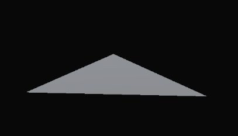

Папки
=====

.. _installation:

_AssetStore
----------------
Пакеты из Store

_Examples
----------------
Пример использования

Art
----------------
Стандартный набор арта

Animations
~~~~~~~~~~~~~~~~~~
Анимации UI

Fonts
~~~~~~~~~~~~~~~~~~
Шрифты

Materials
~~~~~~~~~~~~~~~~~~
Базовые материалы

Models
~~~~~~~~~~~~~~~~~~
Примитивные модели

Arrow
""""""""""""""""""

   

Capsule
""""""""""""""""""
Cone
""""""""""""""""""
Cube
""""""""""""""""""
Cylinder
""""""""""""""""""
Dodecahedron
""""""""""""""""""
Icoshedron
""""""""""""""""""
Pipe
""""""""""""""""""
Pyramid
""""""""""""""""""
Sphere
""""""""""""""""""
Torus
""""""""""""""""""

Shaders
~~~~~~~~~~~~~~~~~~
null

Sprites
~~~~~~~~~~~~~~~~~~
Базовый UI

Textures
~~~~~~~~~~~~~~~~~~
null

HC-Engine
----------------
Основа шаблона

Plugins
----------------
Плагины

Prefabs
----------------
Префабы

Resources
----------------
Сторонние ресурсы

Scenes
----------------
Сцены

ScriptableObjects
----------------

Scripts
----------------

Settings
----------------
Настройки

Shaders
----------------
Шейдеры

