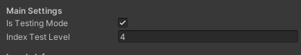
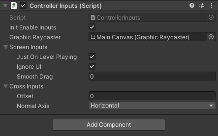
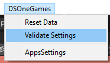

Start
============================

Introduction:
""""""""""""""""""""""""""""

HT-Template is template that used for Hyper casual games to develop prototypes faster. The template has lot of scripts and Systems like we will see.
Please see using examples: Assets/_Examples/
Or with link: https://github.com/DsoneGame/DS1-HC-Template_CPI/tree/main/Assets/_Examples

GameManager:
""""""""""""""""""""""""""""
The class is responsible about the Game statue and manage the start game, win and lose.\

``StartGame()``: To start the game with all logics.

``MakeWin()``: To make win the game with all logics.

``MakeLost()``: To make lost the game with all logics.

Notes:

The three functions controller the progress events, inputs enable and Invokes GameDelegates in the game.
You can get some static info like isStarted, isWin, isFinished….
Controller continue, pause the game and change the timescale.

GameDelegate:
""""""""""""""""""""""""""""

Has some handles:

``onStart``: handle when the player start level.

``onLose``: handle when the player lose level.

``onWin``: handle when the player win level.

``onLevelInited``: handle when the level is loaded. Contents containers of scene and Levels. We will speak about containers later.

LevelManager:
""""""""""""""""""""""""""""

The class is responsible about the level’s management like call load on the game, define the level manage testing mode. Examples:

1. In case of testing mode, the level manager will search the level is scene and use it and define it. If not exist then will load level with index of mode test.

2. In case of not existing mode test the level, manager will instantiate the level and define it.

3. Give the current level play on.

4. Controlled GameLevel if you want access to the current gameLevel you can from LevelManager but before you need be sure that the level isLoaded.
Containers: there is two containers, it’s helps for more accessibility between the level and scene. 

Examples:

``SceneContainer``: that content some objects of scene like GameManager. And It gives it to the current level objects like player.

``LevelContainer``: that content some objects of levels like player. And It gives it to the scene level objects like camera.

``GameLevel``: it’s existed on the prefab of level. You can define there some objects, Has the LevelContainer.

LevelInfoOS: you can put there some settings about the levels. The level prefab is stored it there. Every level has index you when you click Validate (In editor mode) the levels will rated. Depend on the id of level.

Testing Mode:
""""""""""""""""""""""""""""

In GameSettings you can make the Mode Test enable and choice the level that you want to test for example let’s test level 5 then when you click play in editor The level that will loaded is with testing level index.

If the level is existing in the main scene so that level will define like current level.
LevelsData: The level data saved in this class you can reached the level data from here.

Examples:

``LevelsData.idLevel`` => this variable will give you the id of current level.

``LevelsData. playerLevel`` => this variable will give you what the player see he play.

Inputs system:
""""""""""""""""""""""""""""

1. ControllerInputs is a class for controller the inputs in the game.
You can call the function OnMouse(MouseType type).
MouseType is Enum with values: Up or Down or Non. The function will detect the player clicking like Input.GetMouseButtonDown(0) but better because you can controller the enable Inputs and ignore the UI clicks and others…

2. ClickAndDrag Is class having delegates executed when Player drags or click. The delegates exist: onBeginDrag, onEndDrag, onDragging and onClicked. In unity is exist
something like this but not working well because it’s work just on UI But this delegate It’s works in all case and you can ignore the UI and others. Plus has bool isDraging and isClicked to get the player clicking state. You can controller the smooth of dragging and click.

3. CrossInputs: is class for get the player click point on plane (Without collider). You can choice horizontal or vertical plane. Then call function GetCrossPoint(camera) It will give you the cross point between plane and camera Ray cast. This helps you to define some positions in word space without collider. And you can use offset to change the plane position.

       
UI:
""""""""""""""""""""""""""""

MainCanvasManager: The class where controller the main scene UI. And all panels in the game. You can get the current activate panel.

1- Panel: Every panel in the game has class panel for can controller show and hide this panel.

2- IPanel: To implement it in UI panels like class Panel or SettingsView.

GameSettings:
""""""""""""""""""""""""""""

It’s ScriptableObject asset has the information about the game settings like ModeTest, TotalLevels(Auto calculated), You can add some variables here for level designer to change the game settings. Or for AB Testing.

Game Coins:
""""""""""""""""""""""""""""

1. CoinsData: the class where we manage the coins and diamonds…

2. You can create multicoins manager example one for money and one for diamonds.

3. Call function AddCoins(int amount), or RemoveCoins(int amount).

4. Save automatic when you update the amount.

5. Delegate onUpdate invoked every changing the coins value.

6. Init coins is the default coins value, When the player entry first time play, he will start with this number of coins.

7. coinsCollected is the value of coins collects in this level. When you start new level, the value will be 0 again;

8. Components TotalCoinsText and TotalCoinsCountText Can count values of coins and updated in the runtime. TotalCoinsCountText Has animation when you add coins It’s counter animation.

Debugger:
""""""""""""""""""""""""""""

ScreenDebugger: OnGUI function has some Styles and Rects to make labels, You can use engine.GUILib class to debug some labels to show some statues like FPS, … 

example:
.. code-block:: csharp

        void OnGUI()
        {
            engine.GUIDisplay.MakeLabel("Level completed: " + GameManager.isWin, 2);
        }
        
FPSDisplay: For display the current FPS.

Editor Mode:
""""""""""""""""""""""""""""

1- Validate: This is a function that help for change the settings in editor in MonoBehaviours and ScriptableObjects with writing automatics. By adding the IValidate interface on the script. And inside the function You can write your automatic code.
 
Example:
.. code-block:: csharp

        public class Player : MonoBehaviour, IValidate
        {
             public Rigidbody _rigid;
             public void Validate()
             {
                    _rigid = GetComponent<Rigidbody>();
             }
        }
        
Here Validate function will execute when you click button Validate Settings in editor.
The deference between OnValidate and Validate is OnValidate execute when you change value of the Component. Validate when you click Validate settings button.

2- Reset Data: It has the same method like validate It has interface name IResetData and void ResetData() when you call this function in MonoBehaviours and ScriptableObjects. And with button Reset Data in editor it will Reset the data to default. Example imagine that you have game and default level is 1 and score 0 and you start play levels in editor for tests and you reached the level 10 and score 1500. Then you want restart the test or
come back to default settings. You can reset all info with Reset Data button to level 1, and score zero and you can test again and reset again. This help for faster testing.

3- IAwake: It’s interface for scriptable object, in scriptable object not execute Awake on editor when you start play just on runtime this interface helps you to execute Awake function every click plays.

4- EditorManager: is static class for save scene and assets, search some assets in the project, GameObjects (activate Object and not activate) in activate scenes.

5- SceneEditor: To save scenes in the game.

6- ScriptableManager: To search some types of ScriptableObjects in the project.

Saver
""""""""""""""""""""""""""""

1- ObjectSaver is a static class that help to save any serializable object. Has some functions like: ObjectExist, LoadObject, SaveObject and InitObject.

2- IData: To implement it in savers data classes.
• CameraView: With this asset you can controller the camera view with Cinemachine assets

CameraView:
""""""""""""""""""""""""""""

1.CameraView:is class that contents the CinemachineVirtualCamera and tag. You can controller the camera enable’s and change Follow or LookAt transform.

2. ControllerVirtualCameras: is object attached in the scene to add some cameras in the manager and initialize the view and deinitialize;

3. VirtualCamerasManager: To manage all views, like FindView, switch, SetFollow, SetLookAt, and more others please see the class to more information.

Store: Not ready.
""""""""""""""""""""""""""""

Audio and vibration: 
""""""""""""""""""""""""""""

It’s existing scriptable to check the enable vibration and audio. The player can change in settings view. The data is saved automatic when he player switch examples of using:

1. AudioVibrationManager.enableAudio, enable vibration. For check if player has enableAudio call Audio.Play() as an example. With Vibration the same.

2. You can switchEnable or SetEnable(bool enable).

3. IT’s existing an event when the settings is updated.

