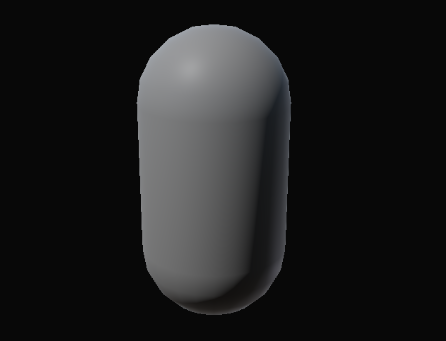
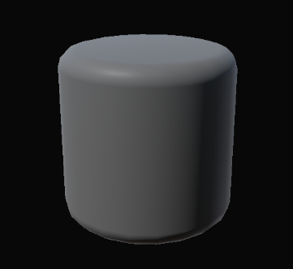
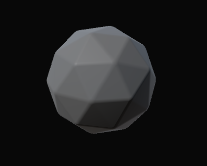
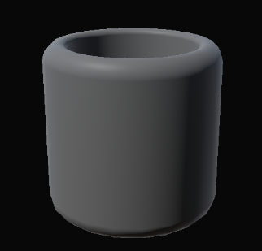
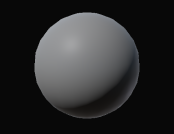

Models
============================

Здесь собран набор примитивных мешей для прототипирования.

Arrow
------------------
.. image:: img/primitives/arrow.png
   :height: 300px
   :width: 300 px
   :scale: 100 %
   :alt: alternate text
   :align: center
   
   
Capsule
------------------

Cone
------------------
.. image:: img/primitives/cone.png
   :height: 300px
   :width: 300 px
   :scale: 100 %
   :alt: alternate text
   :align: center

Cube
------------------
.. image:: img/primitives/cube.png
   :height: 300px
   :width: 300 px
   :scale: 100 %
   :alt: alternate text
   :align: center
   
Cylinder
------------------

   
Dodecahedron
------------------

Icoshedron
------------------
.. image:: img/primitives/icoshedron.png
   :height: 300px
   :width: 300 px
   :scale: 100 %
   :alt: alternate text
   :align: center
   
Pipe
------------------

Pyramid
------------------
.. image:: img/primitives/pyramid.png
   :height: 300px
   :width: 300 px
   :scale: 100 %
   :alt: alternate text
   :align: center

Sphere
------------------

Torus
------------------
.. image:: img/primitives/torus.png
   :height: 300px
   :width: 300 px
   :scale: 100 %
   :alt: alternate text
   :align: center
    