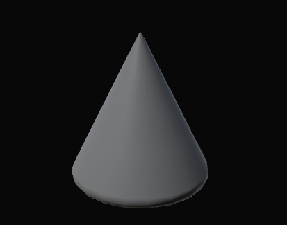

Models
============================

Здесь собран набор примитивных мешей для прототипирования.

Arrow
------------------
.. image:: img/primitives/arrow.png
   :height: 300px
   :width: 300 px
   :scale: 100 %
   :alt: alternate text
   :align: center
   
   
Capsule
------------------
.. image:: img/primitives/capsule.png
   :height: 300px
   :width: 300 px
   :scale: 100 %
   :alt: alternate text
   :align: center

Cone
------------------

Cube
------------------
.. image:: img/primitives/cube.png
   :height: 300px
   :width: 300 px
   :scale: 100 %
   :alt: alternate text
   :align: center
   
Cylinder
------------------
.. image:: img/primitives/cylinder.png
   :height: 300px
   :width: 300 px
   :scale: 100 %
   :alt: alternate text
   :align: center
   
Dodecahedron
------------------
.. image:: img/primitives/dodecahedron.png
   :height: 300px
   :width: 300 px
   :scale: 100 %
   :alt: alternate text
   :align: center

Icoshedron
------------------
.. image:: img/primitives/icoshedron.png
   :height: 300px
   :width: 300 px
   :scale: 100 %
   :alt: alternate text
   :align: center
   
Pipe
------------------
.. image:: img/primitives/pipe.png
   :height: 300px
   :width: 300 px
   :scale: 100 %
   :alt: alternate text
   :align: center

Pyramid
------------------
.. image:: img/primitives/pyramid.png
   :height: 300px
   :width: 300 px
   :scale: 100 %
   :alt: alternate text
   :align: center

Sphere
------------------

Torus
------------------
.. image:: img/primitives/torus.png
   :height: 300px
   :width: 300 px
   :scale: 100 %
   :alt: alternate text
   :align: center
    